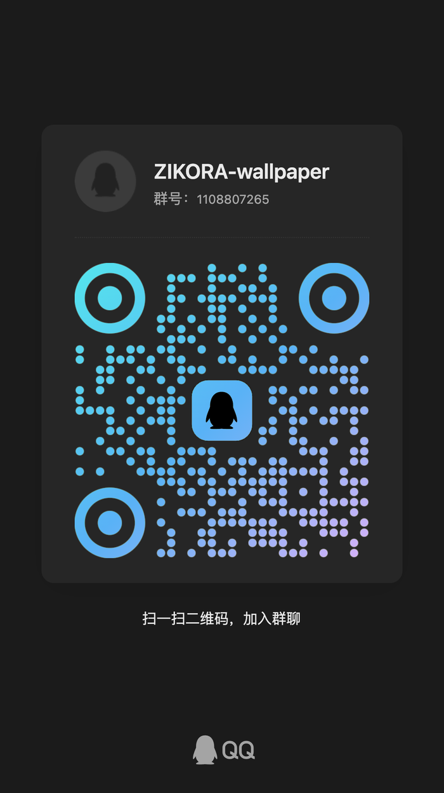

# ZIKORA

一个原生 macOS 壁纸管理器，从自定义图片源获取壁纸，并按计划自动更新桌面。

[官方网站](https://zikora-wallpaper.oriental011212.workers.dev/) · [下载安装包](https://github.com/oriental1212/ZIKORA-wallpaper/releases)

ZIKORA 将图片源、每周计划、壁纸轮播和本地图库集中在一个应用中。它使用 SwiftUI 构建界面，以 SwiftData 保存配置与历史记录，并通过 macOS 系统 API 更新桌面壁纸。

## 功能

- 添加、编辑和验证自定义 HTTPS 图片源。
- 为一周七天分别安排图片源，并设置不可用时的默认源。
- 使用每日更新或定时轮播模式，支持随机与时间顺序。
- 在本地图库中搜索、预览、切换和清理已下载壁纸。
- 通过菜单栏快速更新、切换壁纸或打开主窗口。
- 支持开机启动、失败重试和本地缓存保留策略。

支持 JPEG、PNG、HEIC、HEIF 和 WebP。下载内容会根据实际文件数据进行校验，而不只依赖 URL 或扩展名。

## 下载

前往 [GitHub Releases](https://github.com/oriental1212/ZIKORA-wallpaper/releases) 下载最新安装包。产品介绍与更多信息见 [ZIKORA 官网](https://zikora-wallpaper.pages.dev/)。

## 系统要求

- macOS 14.0 或更高版本
- Xcode，需包含 macOS 14 SDK 或更高版本

## 从源码构建

```bash
git clone https://github.com/oriental1212/ZIKORA-wallpaper.git
cd ZIKORA-wallpaper
./scripts/build
open ZIKORA-wallpaper.xcodeproj
```

在 Xcode 中选择 `ZIKORA-wallpaper` scheme 和 `My Mac` 目标，然后运行项目。

首次启动后：

1. 在“壁纸源”中添加图片 URL，并完成连接测试。
2. 为每周计划选择图片源，按需设置默认源。
3. 在“设置”中选择每日更新或轮播模式。
4. 返回仪表盘，执行一次“立即更新”。

## 开发

项目没有第三方运行时依赖，主要使用 Apple 原生框架：

- SwiftUI 与 AppKit
- SwiftData
- Swift Concurrency
- ServiceManagement
- Swift Testing

常用命令：

```bash
./scripts/test   # 运行完整测试套件
./scripts/build  # 构建 Debug 版本
./scripts/check  # 运行测试并构建 Release 版本
```

构建脚本默认关闭代码签名，并将 DerivedData 写入临时目录。可通过 `ZIKORA_DERIVED_DATA` 指定其他位置。

## 本地数据

配置、下载记录和壁纸文件保存在当前用户的 Application Support 目录中：

```text
~/Library/Application Support/cn.zhikezhui.ZIKORA-wallpaper/
```

ZIKORA 不使用 CloudKit。启用“开机启动”时，macOS 可能要求用户在系统设置中确认登录项权限。

## 支持与交流

如果 ZIKORA 对你有帮助，可以自愿支持项目维护；问题反馈和使用交流可加入 QQ 群。

| 支持开发 | 加入交流群 |
| --- | --- |
|  |  |
| 微信支付 | QQ 群：`1108807265` |

## 许可证

本项目基于 [MIT License](./LICENSE) 开源。
